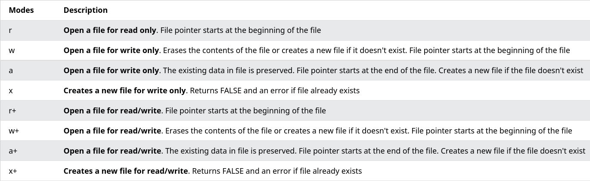

# Cookiesy

#### Tworzenie cookiesa

```php
setcookie(name, value, expire, path, domain, secure, httponly);
```

name jest required, reszta optional

#### Cookies z wygasaniem

```php
setcookie($cookie_name, $cookie_value, time() + (86400 * 30), "/");
```

tu jest miesiac (86400 sekund = 1 dzien)

#### Sprawdzenie czy cookie istnieje

```php
<?php
if(!isset($_COOKIE[$cookie_name])) {
  echo "Cookie named '" . $cookie_name . "' is not set!";
} else {
  echo "Cookie '" . $cookie_name . "' is set!<br>";
  echo "Value is: " . $_COOKIE[$cookie_name];
}
?>
```

#### Modyfikacja wartosci

uzyj jeszcze raz setcookie();

#### Usuwanie cookiesa

setcookie(); z data wygasniecia z przeszlosci np:

```php
// set the expiration date to one hour ago
setcookie("user", "", time() - 3600);
```

#### Sprawdzenie czy cookiesy sa wlaczone

ustawiam jakiegos losowego cookiesa i sprawdzam czy sie zapisal

```php
<?php
setcookie("test_cookie", "test", time() + 3600, '/');

if(count($_COOKIE) > 0) {
  echo "Cookies are enabled.";
} else {
  echo "Cookies are disabled.";
}
?>
```

# Sesja

#### Start i zmienne sesji

`session_start()<br>`
`$_SESSION[];`

zeby odczytac zmienne sesji na innej stronie to musza byc session_start(); no i trzeba przeczytac odpowiednia zmienna np. `$_SESSION['test'];`

#### Wyswietlenie wszystkich dostepnych zmiennych sesji

mozna uzyc `print_r($_SESSION);`

#### Zmiana wartosci zmiennej

tak jak ze zwykla zmienna, trzeba ja nadpisac

```php
$_SESSION['test']='xd';
```

#### Konczenie sesji

`session_unset();` - usuwa wszystkie zmienne sesji `<br>`
`session_destroy();` - usuwa sesje

# Operacje na plikach

#### Wyswietlenie zawartosci pliku sposob 1

mozna uzyc funkcji `readfile();` - dziala ale ta funkcja jest dosyc ograniczona

przyklad

```php
<?php
echo readfile('plik.txt');
?>
```

#### Otwieranie pliku - `fopen()`

ma 2 parametry - pierwszy to nazwa pliku, drugi to tryb w jakim otwieramy

przyklad otwarcia pliku, tu jest `or die()` - to wyswietla komunikat w przypadku bledu w otweiraniu

```php
<?php
$myfile = fopen("webdictionary.txt", "r") or die("Unable to open file!");
echo fread($myfile,filesize("webdictionary.txt"));
fclose($myfile);
?>
```

##### Tryby otwierania



#### Czytanie zawartosci - `fread()`

tez ma 2 parametry - pierwszy to nazwa pliku, drugi to maksymalna liczba bajtow do przeczytania

przyklad przeczytania calego pliku

```php
fread($myfile,filesize('plik.txt'));
//gdzie $myfile to fopen(), patrz przyklad wyzej
```

#### Zamykanie pliku - `fclose()`

po prostu zamyka plik<br>
`fclose($myfile);`

#### Czytanie pojedynczych linii - `fgets()`

przyklad wyswietlenia tylko pierwszej linii pliku

```php
<?php
$myfile = fopen("webdictionary.txt", "r") or die("Unable to open file!");
echo fgets($myfile);
fclose($myfile);
?>
```

Mozna to polaczyc z `feof()` zeby czytac linia po linii do konca pliku<br>
przyklad

```php
<?php
$myfile = fopen("webdictionary.txt", "r") or die("Unable to open file!");
// Output one line until end-of-file
while(!feof($myfile)) {
  echo fgets($myfile) . "<br>";
}
fclose($myfile);
?>
```

#### Pojedynczy znak - `fgetc()`

wyswietla pojedynczy znak, mozna tak samo polaczyc z whilem zeby wyswietlal caly plik po jednym znaku<br>
przyklad wyswietlenia calego pliku po jednym znaku

```php
<?php
$myfile = fopen("webdictionary.txt", "r") or die("Unable to open file!");
// Output one character until end-of-file
while(!feof($myfile)) {
  echo fgetc($myfile);
}
fclose($myfile);
?>
```

#### Tworzenie pliku

tutaj `fopen()` w odpowiednim trybie<br>
np `$plik=fopen('plik.txt', 'w');`<br>
jak nie dziala to pewnie brak uprawnien, patrz w logi

#### Zapisywanie do pliku - `fwrite()`

ma 2 parametry, pierwszy - plik (zmienna z fopen()), drugi string do zapisania<br>
przyklad

```php
<?php
$myfile = fopen("newfile.txt", "w") or die("Unable to open file!");
$txt = "John Doe\n";
fwrite($myfile, $txt);
$txt = "Jane Doe\n";
fwrite($myfile, $txt);
fclose($myfile);
?>
```

tu jest `w` w `fopen()` co oznacza ze usunie sie biezaca zawartosc pliku, jezeli chcemy zostawic zawartosc to otwieramy w trybie `a`


